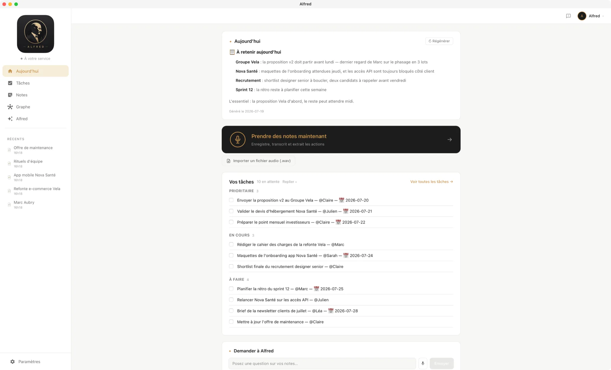

<p align="center">
  
</p>

# Alfred

**Alfred** is a personal assistant desktop app (Tauri 2 + React/TypeScript) that
records your meetings and voice notes, transcribes them **locally** with
Whisper, and turns them into structured notes, summaries, and tasks in a plain
**Markdown vault** — with Claude as your AI assistant on top of it all.

[](https://github.com/do-now-io/alfred/releases/latest)
[](https://alfred.do-now.io/)

Windows and macOS installers (`.msi`/`.exe`, `.dmg`) are published on the
[Releases page](https://github.com/do-now-io/alfred/releases/latest).



## What it does

- 🎙️ **Recording** — microphone and system audio (Windows: WASAPI loopback,
  mic + system mixed by default), or import an existing `.wav` file.
- 📝 **Local transcription** — [whisper.cpp](https://github.com/ggml-org/whisper.cpp)
  runs on-device, no audio ever leaves your machine to transcribe it. A
  glossary derived from your own context (people, company, jargon) improves
  accuracy on proper nouns.
- 🤖 **AI notes & tasks** — Claude turns a transcription into a structured
  summary and a task list, with a review screen to correct anything before it's
  finalized.
- 🗂️ **Markdown vault** — everything lives as plain `.md` files you own
  (`alfred-raw/` for raw transcriptions, `alfred-intelligence/` for
  AI-generated notes and `Todo.md`), organized by project, with wikilinks and a
  notes graph.
- 💬 **Chat over your notes** — ask Alfred questions about your own notes
  (RAG), get answers with clickable sources.
- 🔗 **Sharing** — share a note or your task list as a public read-only link.
- 🌐 **FR / EN** — full UI and AI-output localization.
- 🔑 **Bring your own key or subscribe** — use your own Anthropic API key, or
  subscribe to **AlfredIA** (managed proxy, no key to manage).

## Building from source

### Windows

Whisper (local transcription, CPU) is **on by default** — the app builds
`whisper.cpp` via the `whisper` Cargo feature, part of `default`.

**Prerequisites**

- **Rust** (MSVC toolchain) — install via [rustup](https://rustup.rs). Accept the
  default `x86_64-pc-windows-msvc` toolchain.
- **Visual Studio Build Tools** with the **"Desktop development with C++"**
  workload (provides the MSVC linker Rust needs).
- **WebView2 runtime** — preinstalled on Windows 11. If missing, install the
  Evergreen runtime from Microsoft.
- **Node.js** 18+.
- **CMake** — `winget install Kitware.CMake` (builds `whisper.cpp`).
- **libclang** (for `bindgen`) — easiest without admin: `pip install --user libclang`.
  Alternatively install LLVM (`winget install LLVM.LLVM`, requires admin).

Don't want to install CMake/libclang right now? Skip Whisper for a session with
`./scripts/dev-windows.ps1 -NoWhisper` (recording still works, no transcription).

**Setup** — from the repo root, in PowerShell:

```powershell
./scripts/setup-windows.ps1   # installs sqlx-cli, creates the compile-time dev DB + migrations
npm install
./scripts/dev-windows.ps1     # auto-discovers libclang.dll, runs `tauri dev`
```

`setup-windows.ps1` creates `src-tauri/alfred_dev.db` and runs the migrations so
the compile-time `sqlx::query!` macros can verify against the schema. That DB is
used only at build time — at runtime the app creates its own database in the
Windows app-data directory (`%APPDATA%\com.alfred.app`).

The first build is slow (it compiles whisper.cpp). The CPU backend works on any
machine. To use your GPU instead (CUDA/Vulkan), enable the matching `whisper-rs`
feature in `src-tauri/Cargo.toml` and install that SDK — not covered here.

**Model** — the `small` model is **bundled into release builds** — it works
offline from the first launch, no download needed. In dev, if it's not already
fetched, download it from **Settings → Transcription** (or run
`./scripts/fetch-whisper-model.ps1` to fetch it into `src-tauri/models/` ahead
of time). Models are cached in `%APPDATA%\com.alfred.app\models\`.

**Packaging (release build)**

```powershell
./scripts/build-windows.ps1
```

Fetches the `small` model into `src-tauri/models/` (skipped if already present
— that path is gitignored, so every machine fetches it once), then runs
`tauri build`. Installers land in `src-tauri\target\release\bundle\` (`msi\`
and/or `nsis\`). Release builds published on GitHub are Authenticode-signed;
local builds are not unless you have your own signing secrets.

### macOS

Whisper is on by default here too (needs cmake + Xcode CLT, both already
required for macOS builds).

```bash
npm install
npm run tauri:dev                 # dev, with Whisper
./scripts/fetch-whisper-model.sh  # optional: pre-fetch the `small` model into src-tauri/models/
./build-macos.sh                  # release build (.app + .dmg), fetches + bundles `small`, then builds
```

### Audio system capture

- **Windows:** `system_only` / `mixed` recording sources are implemented via
  WASAPI loopback — no extra setup needed.
- **macOS:** not implemented yet (ScreenCaptureKit helper, tracked separately).
  `system_only`/`mixed` return an error; use `mic_only`.

### Known Windows follow-ups

- **Ingest ("run Claude" feature):** resolves the `claude` CLI from PATH; a
  `.cmd` shim may not resolve. Only affects the manual ingest action.

## Project structure & specs

The functional and technical source of truth lives in [`spec/`](spec/README.md)
(one file per module, with a status index). The v1 backlog is tracked in
[`ROADMAP.md`](ROADMAP.md). The AlfredIA backend (Claude proxy + metrics,
optional subscription) lives in a separate private repository and isn't part
of this codebase.

## Contributing

Contributions are welcome — see [`CONTRIBUTING.md`](CONTRIBUTING.md) for how to
propose changes, the branch/PR workflow, and coding conventions.

## License

Licensed under the [Apache License, Version 2.0](LICENSE).

---

Alfred is built by [do·now](https://do-now.io/).
